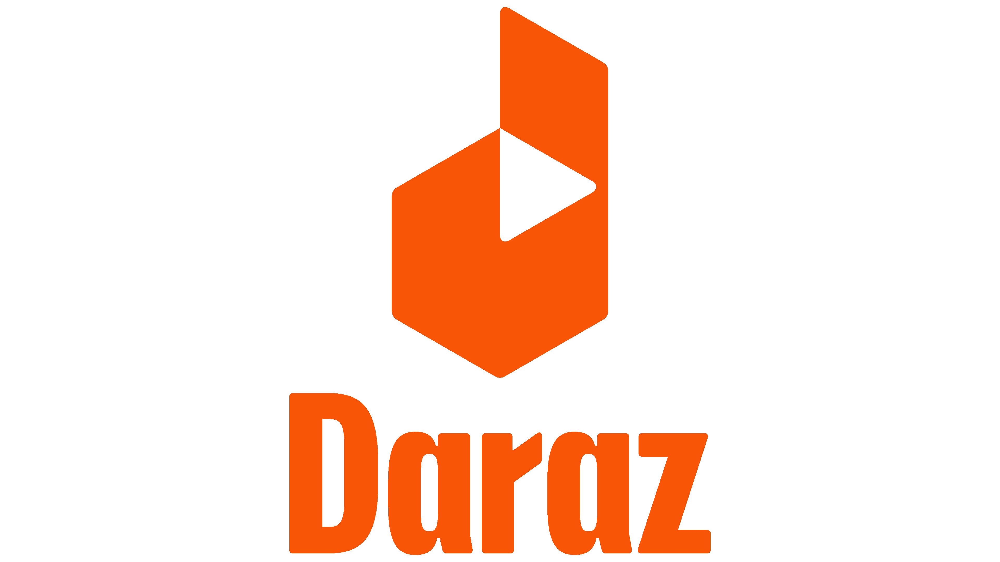

# daraz-np-smartphone-knowledge-graph


a python based knowledge graph project which consists of three main components, namely a scraper for daraz.np.com/smartphones, a transformer that transform the scrape data into a csv file, and a final component that is used to load the csv file into neo4j db.

## Table of Contents
- Build with
- Getting Started
	- Prerequisites
	- Installation
- Usage
- Project structure
- Contribution
- License

## Build with
- programming language: **python**
- web scraping library: **requests**, **concurrent**
- graph database: **neo4j:3.5-community**
- visualization: **neo4j-browser**, **networkx**

You can check out other installed libraries in requirements.txt file.

## Getting Started

### Prerequisites
 To run this Dockerized project, you will need to have the following software and tools installed on your machine.

 -  **Docker**: You can download and install Docker from the official website at [https://www.docker.com/products/docker-desktop](https://www.docker.com/products/docker-desktop). Follow the installation instructions for your operating system to install Docker.
    
- **Project dependencies**: This project requires Python 3.7, Neo4j:3.5-community and other dependencies to be installed in the Docker container. These dependencies will be installed automatically when you build the Docker image.
- **Docker compose**:  Docker Compose is a tool for defining and running multi-container Docker applications. You can download and install Docker Compose from the official website at [https://docs.docker.com/compose/install/](https://docs.docker.com/compose/install/). Follow the installation instructions for your operating system to install Docker Compose. 

By ensuring that you have Docker and any necessary project dependencies installed, you can easily build and run the Docker container for this project. 

###  Installation
To get started with this project, follow these steps:
1. Clone the repository to your local machine:
	```bash
	git clone git@github.com:s-4-m-a-n/daraz-np-smartphone-knowledge-graph.git
	```
2. Navigate to the project directory
	```bash
	cd daraz-np-smartphone-knoledge-graph
	```
3. create ".env" file
	- you can simply copy the content from .env-temp file and add the credentials
4. docker compose build
	```bash
	docker compose build
	```
5. docker compose up
	```bash
	docker compose up
	```
6. get into cli-app container bash to run the components
	- get the name of the running components  
		```bash
		docker ps
		```
	- execute the bash inside running cli-app container
		```
		docker exec -it <container_hash> bash
		```
	- run the pipeline inside bash
		```bash
		python CLI_app.py --components '["scraper", "transformer", "kg_builder"]'
		```
		- It is not mandatory to add all three components, if you already have scraped data into the artifact/ directory, then you can simply ignore scraper components by specifying only the "transformer" and "kg_builder" component.
		
7. run neo4j-browser to perform queries
	>visit http://localhost:7474/


## Contribution

If you're interested in contributing to this project, please follow these steps:
1.  Fork this repository.
2.  Create a new branch for your feature or bug fix.
3.  Make your changes and commit them to your branch.
4.  Submit a pull request to this repository.

## Project structure
The structure of the project is as shown below:
 ```bash
 |-notebook/
 |-src/
	 |-components/
	 |-pipeline/
	 |-__init__.py
	 |-exceptions.py
	 |-logger.py
	 |-utils.py
	 |-config.json
|-CLI_app.py
|-Dockerfile
|-docker-compose.yml
|-requirements.txt
|-setup.py
|-.env-temp
|-archives.zip
 ```
 - **notebook/**
	 - In the notebook directory you will file three notebooks, which explain the detail explanation (with code) of web scraping, building knowledge graph from networkx and neo4j.
- **src/**
	- this directory contains components and pipeline for scraping, transforming and loading graph into neo4j.
- **CLI_app.py**
	- it is a python script for executing pipeline components.
- **.env-temp**
	- make sure to create ".env" file and copy .env-temp and *add credentials* for neo4j db.
- **archives.zip**
	- sometime daraz detects our scraper (bot), and it will get blocked by the server, thus unable to scrape the data.For such case you can copy the "scraped_data.json" into a "artifacts/" directory before building the container.
- **src/config.json**
	- you can specify the name for artifact root directory and file name for each component's output.

## LICENSE:
This project is licensed under the MIT License. See the [LICENSE](https://github.com/s-4-m-a-n/subscene-API/blob/master/LICENSE) file for details.
[](https://www.facebook.com/suman.dhakal.39982) [](https://twitter.com/s_4_m_A_N)

